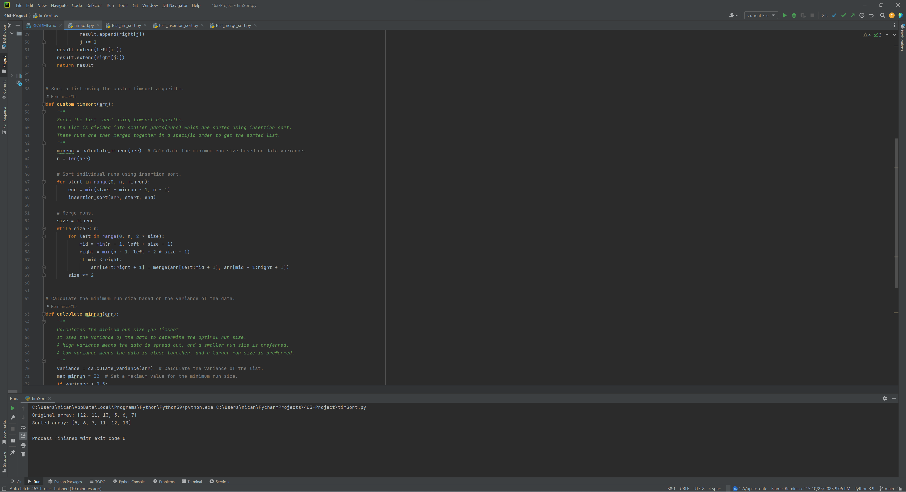
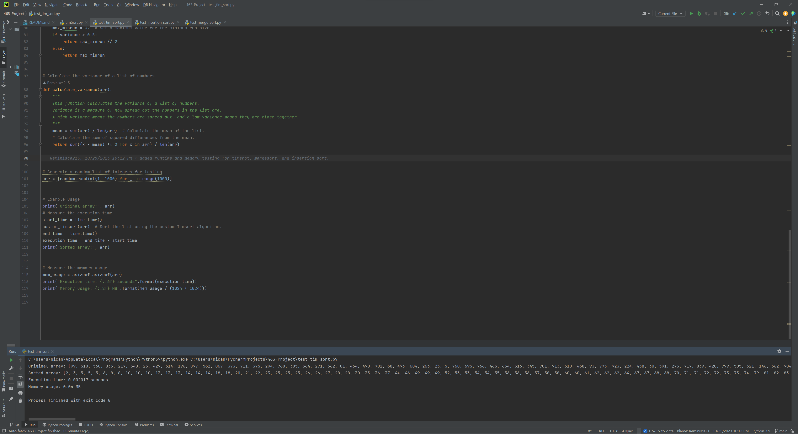
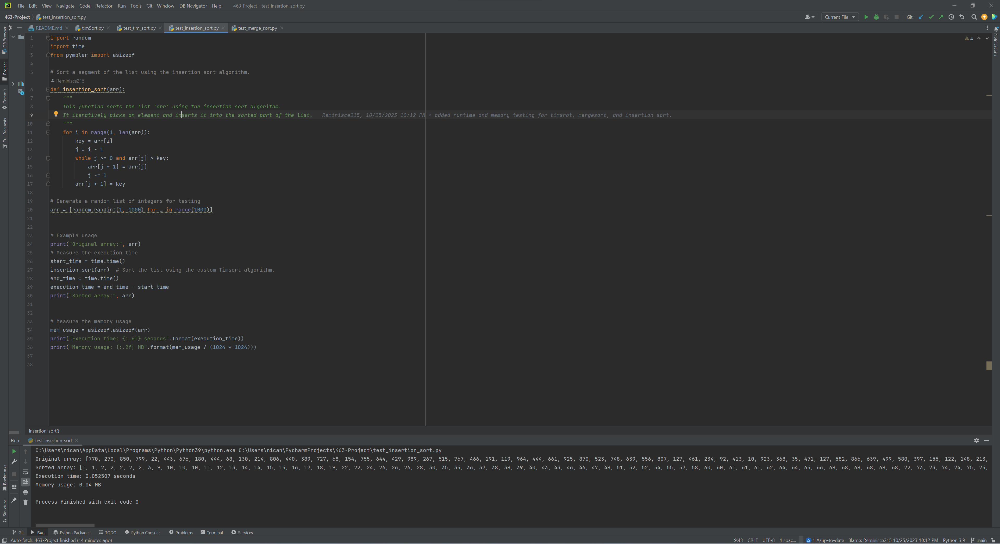
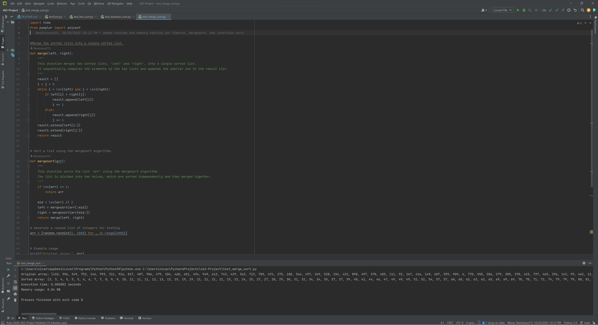

# 463 Project 
- Timsort algoirthm with heuristic variance function

# Timsort REPORT

- The goal of this project is to implement the Timsort algorithm. This algorithm is a hybrid sort that takes elements
of mergesort and insertion sort to create a highly efficient sort that is often used on real world datasets.
The algorithm starts by deciding the number of "runs", a sub array of elements that are already ordered
in ascending or descending order. The method for deciding the number of runs depends on the implementation
and is often done dynamically. Sometimes the numbers of runs are decided by a number divisible by 2, 
but in this case I will be using a heuristic function for variance to determine the number of runs.

- Once the run is established, insertion sort is used to sort runs. In insertion sort the first element 
is considered sorted. Then the element to the right is set as key, if key is greater than sorted element(s),
it will stay be right of sorted, if it is less than, it will be left of sorted. Once runs have been sorted,
they will then be merged into a final output array that is sorted in asending order. Although insertion
sort has an average complexity of O(n^2), it can often be better than mergesort when sorting smaller
arrays, close to O(n) even. It also works well with partially sorted arrays. This one of the main
reasons why Timsort is so effective.

- When comparing the Timsort with insertion sort, in regard to average time complexity, Timsort is much more
efficient at O(nlogn) complexity opposed to the O(n^2) of insertion sort. This can be seen in a benchmark
run where the execution time for a timesort with 1000 random elements is .00342 seconds. For insertion sort
it is .05174 seconds. This difference in efficiency will of course be more much distinct given a larger
dataset. The space complexity of these trial runs is 0.4MB but insertion sort actually has better space
complexity because elements are sorted in place as opposed to Timsort which uses a temporary array.
On a trial run for merge sort, it had an execution time of 0.00710 seconds, faster than insertion sort but
a bit slower than timsort. Timsort and mergesort actually have the same average time complexity and 
space complexity but timsort is better at dealing with partially ordered datasets because it takes
advantage of the properties of insertion sort. 

Timsort Demo

Timesort Test Result

Insertion Result

Mergesort Result
